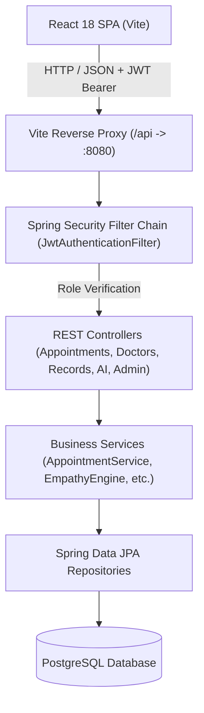
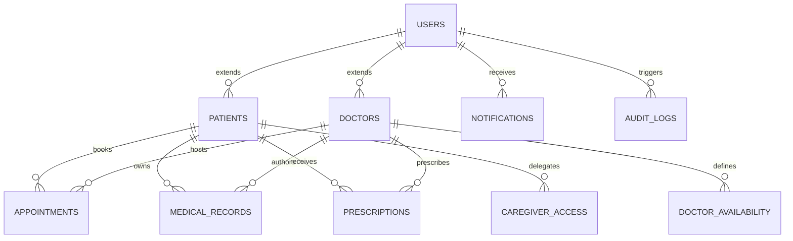

# CarePulse Portal – Intelligent Healthcare Coordination Platform

[](https://spring.io/projects/spring-boot)
[](https://reactjs.org/)
[](https://vitejs.dev/)
[](https://www.postgresql.org/)
[](https://jwt.io/)
[](LICENSE)

**CarePulse Portal** is a production-caliber, enterprise-grade healthcare coordination and clinical workflow management platform. Engineered to connect **Patients**, **Certified Physicians**, and **Healthcare Administrators** into a secure, cohesive ecosystem, CarePulse modernizes clinical scheduling, longitudinal medical records, e-prescribing, proxy caregiver delegations, and patient engagement through an adaptive, safety-first AI health companion.

Designed to reflect real-world healthcare SaaS standards, CarePulse features a decoupled client-server architecture with stateless JWT security, conflict-free scheduling algorithms, HIPAA-aligned audit trails, and an **Empathy Engine™** that dynamically aligns clinical terminology to patient communication preferences.

---

## 📑 Table of Contents
1. [Project Overview](#-project-overview)
2. [Problem Statement](#-problem-statement)
3. [Objectives](#-objectives)
4. [Key Features by Role & Module](#-key-features-by-role--module)
   * [Patient Module](#1-patient-module)
   * [Doctor Module](#2-doctor-module)
   * [Admin Module](#3-admin-dashboard--governance)
   * [Appointment & Scheduling](#4-appointment--scheduling-engine)
   * [Medical Records & Longitudinal Timeline](#5-medical-records-timeline)
   * [Digital Prescription Management](#6-digital-prescription-management)
   * [AI Health Companion with Safety Disclaimers](#7-ai-health-companion)
   * [Empathy Engine™](#8-empathy-engine-communication-adapter)
   * [Caregiver Proxy Access](#9-caregiver-proxy-access)
   * [In-App Notification System](#10-notification-system)
   * [Security & Immutable Audit Trail](#11-security--audit-logging)
5. [Technology Stack](#-technology-stack)
6. [System Architecture](#-system-architecture)
7. [Database Architecture](#-database-architecture)
8. [API Overview](#-api-overview)
9. [Project Folder Structure](#-project-folder-structure)
10. [Installation & Setup Instructions](#-installation--setup-instructions)
    * [Prerequisites](#prerequisites)
    * [Environment Configuration](#environment-configuration)
    * [PostgreSQL Setup](#postgresql-setup)
    * [Backend Setup](#backend-setup)
    * [Frontend Setup](#frontend-setup)
11. [Demo Credentials](#-demo-credentials)
12. [Screenshots](#-screenshots)
13. [Future Enhancements](#-future-enhancements)
14. [Author & Contributors](#-author--contributors)

---

## 💡 Project Overview

In conventional healthcare portals, patient engagement is frequently fragmented across siloed Electronic Health Record (EHR) databases, rigid appointment portals, and third-party messaging tools. Patients struggle to navigate complex clinical jargon, doctors lack centralized tools to manage dynamic schedules and digital prescriptions, and administrators lack audit transparency.

**CarePulse Portal** addresses these challenges by consolidating the entire care coordination lifecycle into a unified, secure web application. It features automated schedule conflict locks, longitudinal timeline visualization, e-prescriptions, proxy access for family caregivers, and an AI health assistant that explains medical terminology in tailored tones while enforcing strict non-diagnostic medical disclaimers.

---

## ❗ Problem Statement

1. **Scheduling Collisions & Inefficiencies:** Overlapping doctor appointments and rigid time blocks cause clinical delays and high cancellation rates.
2. **Clinical Jargon & Health Literacy Barriers:** Patients often feel overwhelmed by dense medical reports, leading to poor treatment compliance and anxiety.
3. **Fragmented Patient Records:** Crucial clinical notes, prescriptions, and past medical history are frequently separated across incompatible systems.
4. **Caregiver Dependency:** Elderly patients and minors often need trusted family members to manage their appointments, yet most portals lack secure, granular proxy delegations.
5. **Auditing & Regulatory Deficits:** Standard student and MVP healthcare apps lack immutable audit trails required for HIPAA compliance and operational security.

---

## 🎯 Objectives

* **Conflict-Free Appointment Scheduling:** Implement dynamic schedule partitioning and strict database/service locking to eliminate double bookings.
* **Empathetic Patient Communication:** Integrate an Empathy Engine™ capable of rendering information in *Simple*, *Supportive*, or *Professional* tones based on patient preferences.
* **Clinical Safety in GenAI:** Build an informational AI companion with hard guardrails that triage emergencies and never issue unsupervised medical diagnoses.
* **Secure Longitudinal EHR Ledger:** Provide doctors and patients with chronological medical history timelines and verifiable digital prescriptions.
* **Auditable Governance:** Provide platform administrators with real-time KPI metrics, user credential governance, and immutable audit logs.

---

## ✨ Key Features by Role & Module

### 1. Patient Module
* **Personalized Health Dashboard:** Next scheduled appointment preview, clinical record count, active medication regimen, and interactive quick-actions.
* **Specialist Discovery:** Search vetted physicians by clinical specialty (Cardiology, Neurology, Pediatrics, etc.), hospital affiliation, or doctor name.
* **Interactive Slot Booking:** View calculated 30-minute consultation slots partitioned by doctor availability and existing appointments.
* **Appointment Tracking:** Monitor consultation lifecycle (`PENDING`, `CONFIRMED`, `COMPLETED`, `CANCELLED`) with cancellation reasons.
* **Health Ledger Timeline:** Chronological health entries showing doctor diagnosis, presenting symptoms, treatments, and consultation notes.
* **Digital Prescription Ledger:** Access current and past medications with dosage, frequency, course duration, and administration instructions.
* **Proxy Caregiver Access:** Delegate secure, revocable access to trusted family members.

### 2. Doctor Module
* **Clinical Command Center:** Daily overview of assigned appointments, pending consultation requests, and patient metrics.
* **Appointment Confirmation Workflow:** Confirm consultation requests with personalized preparation instructions or cancel with recorded reasons.
* **Weekly Availability Planner:** Define consultation windows by day of the week, shift hours (start/end times), and consultation duration.
* **Assigned Patient Roster:** Quick lookup of assigned patient profiles and full medical histories.
* **Record & Prescription Authoring:** Create detailed clinical consultation notes and generate structured digital prescriptions.

### 3. Admin Dashboard & Governance
* **Executive Metrics & KPIs:** Real-time visibility into total registered patients, certified doctors, completed consultations, active accounts, and appointment status distributions.
* **User Credential Management:** Directory of all registered user accounts with immediate ability to toggle account active status.
* **Security & Audit Logs:** Searchable immutable audit trail recording all user logins, appointment changes, record creation, and admin actions.

### 4. Appointment & Scheduling Engine
* **Dynamic Time Slot Computation:** Divides doctor working shifts into consultation slots (e.g. 30 min) and filters out slots occupied by active bookings.
* **Double-Booking Collision Prevention:** Atomic check-and-reserve transaction logic preventing simultaneous bookings on the same doctor time slot.
* **Automated Slot Release:** When an appointment is cancelled, the slot is immediately returned to the doctor's available calendar.

### 5. Medical Records Timeline
* Chronological visual timeline of patient consultations.
* Captures diagnosis, presenting symptoms, clinical treatment plans, doctor notes, and consultation dates.

### 6. Digital Prescription Management
* Structured e-prescriptions detailing medicine name, dosage, frequency, duration, and patient instructions.
* Direct association with physician author and optional consultation medical record.

### 7. AI Health Companion
* Interactive health assistant designed to explain symptoms, medications, and general health guidelines.
* **Mandatory Safety Disclaimer:** Every interaction displays:
  > *"This AI provides general informational support and does not provide medical diagnosis or replace professional medical advice."*
* **Emergency Triage:** Detects critical symptoms (chest pain, breathing difficulties, stroke signs) and directs users to immediate emergency care.

### 8. Empathy Engine™ Communication Adapter
* Allows patients to choose their preferred communication style via the navigation bar:
  * **SIMPLE:** Uses clear, jargon-free everyday language for maximum accessibility.
  * **SUPPORTIVE:** Warm, encouraging, and reassuring phrasing to alleviate patient stress.
  * **PROFESSIONAL:** Precise, formal, and structured clinical explanations.

### 9. Caregiver Proxy Access
* Enables patients to authorize trusted individuals (e.g., adult children, legal guardians) to view their health records and appointments.
* Full revocation control allowing patients to terminate access at any time.

### 10. Notification System
* In-app notification center with real-time unread badge counts and polling.
* Generates notifications for appointment confirmations, cancellations, record creation, and caregiver updates.

### 11. Security & Audit Logging
* **Stateless JWT Security:** JJWT 0.12.6 token generation with cryptographic HMAC-SHA signing.
* **Password Encryption:** Salted BCrypt password hashing (12 rounds).
* **Role-Based Access Control (RBAC):** Strict controller-level authorization (`@PreAuthorize`) enforcing `PATIENT`, `DOCTOR`, and `ADMIN` boundaries.
* **HIPAA-Ready Audit Trail:** Immutable system logs capturing user email, timestamp, IP address, target entity, and exact system action.

---

## 🛠 Technology Stack

### Frontend Architecture
* **Core:** React 18.3 (Functional Components, Custom Hooks)
* **Build Tool:** Vite 5.4 with Hot Module Replacement (HMR)
* **Routing:** React Router v6 (Declarative Protected & Public Route Guards)
* **API Networking:** Axios with Request & Response Interceptors
* **Styling:** Custom CSS Design System (Glassmorphic cards, CSS custom properties, responsive grid)
* **Typography:** Google Fonts (Inter & Plus Jakarta Sans)
* **Iconography:** Lucide React

### Backend Architecture
* **Framework:** Spring Boot 3.3.4 (Java 17)
* **Web Layer:** Spring MVC REST Controllers (`@RestController`, `@RequestMapping`)
* **Security:** Spring Security 6, JJWT 0.12.6, BCrypt Password Encoder
* **Persistence & ORM:** Spring Data JPA, Hibernate ORM
* **Validation:** Jakarta Bean Validation (`@Valid`, `@NotNull`, `@NotBlank`)
* **Build System:** Apache Maven 3.8+

### Database
* **Database Engine:** PostgreSQL 16+
* **Dialect:** PostgreSQLDialect with transactional relational modeling (3NF)

---

## 🏛 System Architecture

CarePulse follows a clean layered enterprise architecture:



For complete technical diagrams and layer breakdowns, see [docs/ARCHITECTURE.md](docs/ARCHITECTURE.md).

---

## 🗄 Database Architecture

The relational schema is normalized into 10 structured tables with foreign key cascades, unique constraints, and B-tree indexes:



For table definitions, indexing strategies, and migration scripts, see [database/README.md](database/README.md) and [database/schema.sql](database/schema.sql).

---

## 📡 API Overview

CarePulse provides RESTful endpoints organized across 9 controllers:

| Module | Base Path | Key Methods & Actions |
| :--- | :--- | :--- |
| **Authentication** | `/api/auth` | `POST /login`, `POST /register/patient`, `POST /register/doctor`, `PUT /communication-preference` |
| **Doctors** | `/api/doctors` | `GET /`, `GET /{id}`, `GET /{id}/availability`, `GET /{id}/slots` |
| **Appointments** | `/api/appointments` | `POST /`, `GET /my`, `GET /{id}`, `PUT /{id}/status`, `DELETE /{id}` |
| **Medical Records** | `/api/records` | `GET /my`, `POST /`, `GET /patient/{id}` |
| **Prescriptions** | `/api/prescriptions` | `GET /my`, `POST /`, `GET /patient/{id}` |
| **Caregivers** | `/api/caregivers` | `POST /`, `GET /my`, `GET /accessible-patients`, `DELETE /{id}` |
| **Notifications** | `/api/notifications` | `GET /`, `GET /unread-count`, `PUT /{id}/read`, `PUT /read-all` |
| **AI Companion** | `/api/ai` | `POST /chat`, `GET /disclaimer` |
| **Administration** | `/api/admin` | `GET /dashboard`, `GET /users`, `PUT /users/{id}/toggle-status`, `GET /audit-logs` |

For complete request/response examples and role requirements, see [docs/API.md](docs/API.md).

---

## 📁 Project Folder Structure

```
CarePulse Portal/
├── backend/                              # Spring Boot 3 Backend
│   ├── src/main/java/com/carepulse/
│   │   ├── config/                       # Security, CORS, JWT, DataInitializer
│   │   ├── controller/                   # REST Controllers
│   │   ├── dto/                          # Data Transfer Objects & Validation
│   │   ├── entity/                       # JPA Entities
│   │   ├── exception/                    # Global Exception Handler & Errors
│   │   ├── repository/                   # Spring Data JPA Repositories
│   │   ├── security/                     # JwtTokenProvider, AuthFilter
│   │   └── service/                      # Business Services & Empathy Engine
│   ├── src/main/resources/
│   │   ├── application.properties        # Production Config (with Env Var bindings)
│   │   └── application-example.properties# Safe configuration template
│   └── pom.xml                           # Maven dependencies
│
├── frontend/                             # React 18 + Vite Frontend
│   ├── src/
│   │   ├── components/                   # Modal, Sidebar, NotificationDropdown
│   │   ├── context/                      # AuthContext, NotificationContext
│   │   ├── layouts/                      # DashboardLayout (TopNav, Empathy Tone)
│   │   ├── pages/                        # Landing, Login, Register, Profile
│   │   │   ├── patient/                  # Discovery, Appointments, Records, AI
│   │   │   ├── doctor/                   # Dashboard, Availability, Roster, Prescriptions
│   │   │   └── admin/                    # Platform Analytics, Audit Logs
│   │   ├── services/                     # Axios API clients
│   │   ├── App.jsx                       # React Router configuration & RBAC Guards
│   │   ├── index.css                     # Glassmorphism Design System Tokens
│   │   └── main.jsx                      # React Root
│   ├── index.html                        # HTML5 Entry
│   ├── package.json                      # Node dependencies
│   └── vite.config.js                    # Vite reverse proxy config
│
├── database/                             # Database Artifacts
│   ├── README.md                         # Database architecture documentation
│   └── schema.sql                        # Deterministic PostgreSQL schema script
│
├── docs/                                 # Technical Specifications
│   ├── API.md                            # Comprehensive REST API reference
│   └── ARCHITECTURE.md                   # System Architecture & Flowchart
│
├── screenshots/                          # Application Previews
│   └── README.md                         # Screenshot guide & placement rules
│
├── .env.example                          # Environment variables template
├── .gitignore                            # Production git exclusion policy
└── README.md                             # Root Project Documentation
```

---

## 🚀 Installation & Setup Instructions

### Prerequisites
* **Java Development Kit:** JDK 17 or higher
* **Build Tool:** Apache Maven 3.8+
* **Node.js Environment:** Node.js 18+ and npm
* **Database:** PostgreSQL 14+ or 16+ running on `localhost:5432`

---

### Environment Configuration
1. In the project root, copy the environment template:
   ```bash
   cp .env.example .env
   ```
2. Configure your local database credentials and JWT secret inside `.env`.
3. In `backend/src/main/resources`, you can optionally create `application-local.properties` (automatically ignored by git) for local overrides:
   ```properties
   spring.datasource.password=your_local_password
   ```

---

### PostgreSQL Setup
Create the `carepulse` database in PostgreSQL:
```sql
CREATE DATABASE carepulse;
```
*(On first startup, Spring Boot Hibernate will automatically create all tables, and the `DataInitializer` will seed realistic demo accounts and clinical data).*

---

### Backend Setup
Navigate to the `backend` directory and run via Maven:
```bash
cd backend
mvn clean spring-boot:run
```
* Server will start on **`http://localhost:8080`**.
* The console will confirm: `Started CarePulseApplication in X.XX seconds` and `CarePulse demo data successfully seeded!`.

---

### Frontend Setup
In a separate terminal, navigate to the `frontend` directory:
```bash
cd frontend
npm install
npm run dev
```
* The Vite dev server will start on **`http://localhost:5173`**.
* Open your browser and navigate to: **`http://localhost:5173`**.

---

## 🔑 Demo Credentials

CarePulse includes pre-seeded demo accounts. The login screen ([http://localhost:5173/login](http://localhost:5173/login)) provides **1-click Demo Login Pill Buttons** for instant evaluation:

| Role | Name | Email | Password | Primary Capabilities |
| :--- | :--- | :--- | :--- | :--- |
| **Patient** | John Doe | `john.doe@example.com` | `Patient@123` | Doctor discovery, dynamic slot booking, medical timeline, AI companion |
| **Patient** | Emma Watson | `emma.watson@example.com` | `Patient@123` | Patient dashboard, prescriptions, caregiver access |
| **Doctor** | Dr. Sarah Jenkins | `dr.jenkins@carepulse.com` | `Doctor@123` | Cardiology specialist, appointment confirmation, availability planner |
| **Doctor** | Dr. Marcus Vance | `dr.vance@carepulse.com` | `Doctor@123` | Neurology clinic appointments & clinical records |
| **Admin** | System Administrator | `admin@carepulse.com` | `Admin@123` | Executive KPI analytics, user status governance, security audit logs |

---

## 📸 Screenshots

Demonstration screenshots are stored in the [screenshots/](screenshots/) directory:

| Feature Screen | Preview |
| :--- | :--- |
| **Landing Page** | [screenshots/README.md](screenshots/README.md) |
| **Patient Dashboard** | [screenshots/README.md](screenshots/README.md) |
| **Doctor Search & Booking** | [screenshots/README.md](screenshots/README.md) |
| **Medical Records Timeline** | [screenshots/README.md](screenshots/README.md) |
| **AI Health Companion** | [screenshots/README.md](screenshots/README.md) |
| **Admin Analytics Dashboard** | [screenshots/README.md](screenshots/README.md) |

---

## 🔮 Future Enhancements

* **WebRTC Telemedicine Video Consultations:** Secure, peer-to-peer encrypted video calling directly within the consultation appointment view.
* **FHIR / HL7 Interoperability:** Integration of standard Fast Healthcare Interoperability Resources (FHIR) JSON representations for seamless hospital data exchange.
* **Direct LLM Integration (Google Gemini / OpenAI):** Plug-and-play LangChain/Spring AI abstraction to connect the Empathy Engine directly to live foundational models.
* **SMS & Push Webhooks:** Automated appointment reminders delivered via Twilio or Firebase Cloud Messaging.
* **PDF Prescription Export:** One-click cryptographically signed PDF generation with QR verification codes for pharmacy dispensing.

---

## 👤 Author & Contributors

* **Naveen** – *Full-Stack Software Engineer & System Architect*
* Developed as a comprehensive Healthcare Coordination platform demonstrating full-stack enterprise architecture with Spring Boot 3, React 18, and PostgreSQL.

---

## 📄 License
This project is open-source and licensed under the [MIT License](LICENSE).
