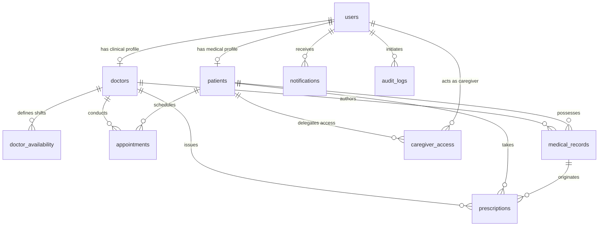

# CarePulse Portal – Database Architecture & Setup Guide

This document outlines the relational database architecture, schema definitions, constraints, and migration strategies powering the **CarePulse Portal**.

---

## 🗄 1. Database Overview

* **Database Engine:** PostgreSQL (Version 14+ or 16+ recommended)
* **Default Database Name:** `carepulse`
* **Default Port:** `5432`
* **Schema Strategy:** Managed through Hibernate DDL auto-generation (`spring.jpa.hibernate.ddl-auto=update`), complemented by the canonical [schema.sql](./schema.sql) file for deterministic migrations and zero-ORM database provisioning.

---

## 📋 2. Relational Schema & Table Definitions

The CarePulse database consists of 10 primary tables designed around normalized relational modeling (3NF):

| Table Name | Description | Primary Key | Key Foreign Relationships |
| :--- | :--- | :--- | :--- |
| `users` | Base identity table storing credentials, authentication roles (`PATIENT`, `DOCTOR`, `ADMIN`), and empathy tone preferences. | `id` (BIGSERIAL) | Self-contained |
| `patients` | Patient demographics, blood group, emergency contact details, allergies, and health history summary. | `id` (BIGSERIAL) | `user_id` -> `users(id)` (1-to-1) |
| `doctors` | Physician credentials, medical license number, specialization, qualifications, and consultation rates. | `id` (BIGSERIAL) | `user_id` -> `users(id)` (1-to-1) |
| `doctor_availability` | Configurable weekly schedules (days of week, shift start/end hours, slot duration). | `id` (BIGSERIAL) | `doctor_id` -> `doctors(id)` (Many-to-1) |
| `appointments` | Booked consultation sessions, appointment dates/times, consultation reasons, and status lifecycle. | `id` (BIGSERIAL) | `patient_id` -> `patients(id)`, `doctor_id` -> `doctors(id)` |
| `medical_records` | Clinical history ledger storing physician diagnoses, presenting symptoms, treatment plans, and notes. | `id` (BIGSERIAL) | `patient_id` -> `patients(id)`, `doctor_id` -> `doctors(id)` |
| `prescriptions` | Digital prescription orders linked to patients, doctors, and optional consultation records. | `id` (BIGSERIAL) | `patient_id` -> `patients(id)`, `doctor_id` -> `doctors(id)`, `medical_record_id` -> `medical_records(id)` |
| `caregiver_access` | Proxy permissions granted by patients to trusted relatives or guardians. | `id` (BIGSERIAL) | `patient_id` -> `patients(id)`, `caregiver_id` -> `users(id)` |
| `notifications` | Event-driven alerts (appointment updates, status changes, caregiver actions). | `id` (BIGSERIAL) | `user_id` -> `users(id)` (Many-to-1) |
| `audit_logs` | Immutable HIPAA-ready security audit trail recording system interactions and data mutations. | `id` (BIGSERIAL) | `user_id` -> `users(id)` (Optional Many-to-1) |

---

## 🔗 3. Entity Relationships Diagram (ERD)



---

## 🛠 4. Database Setup & Initialization

### Option A: Automatic Initialization via Spring Boot (Recommended)
1. Ensure PostgreSQL service is active on `localhost:5432`.
2. Connect to PostgreSQL using your preferred tool (`psql` CLI or pgAdmin):
   ```sql
   CREATE DATABASE carepulse;
   ```
3. Start the Spring Boot backend (`mvn spring-boot:run`).
4. Hibernate automatically inspects the JPA entity models and generates/updates all tables, indexes, and foreign keys.
5. The `DataInitializer` bean automatically seeds demo doctors, patients, schedules, records, and appointments on first startup.

### Option B: Manual SQL Script Execution
If you prefer deterministic SQL execution before launching the backend:
```bash
# Using PostgreSQL CLI (psql)
psql -U postgres -d postgres -c "CREATE DATABASE carepulse;"
psql -U postgres -d carepulse -f database/schema.sql
```

---

## 🧬 5. How Demo Data is Created

CarePulse features an automated seeding pipeline implemented in `backend/src/main/java/com/carepulse/config/DataInitializer.java`:
1. **Idempotent Execution:** Checks `userRepository.count() > 0`. If existing users are detected, the seeder gracefully exits to prevent duplication.
2. **Password Cryptography:** BCrypt hashes all demo credentials using 12 rounds before storing.
3. **Seeded Entities:**
   * **1 Administrator:** `admin@carepulse.com` (`Admin@123`)
   * **3 Specialists:**
     * Dr. Sarah Jenkins (Cardiology, 12 years exp)
     * Dr. Marcus Vance (Neurology, 15 years exp)
     * Dr. Priya Sharma (Pediatrics, 9 years exp)
   * **3 Patients:**
     * John Doe (`john.doe@example.com` - O+ blood group, allergy notes)
     * Emma Watson (`emma.watson@example.com` - A+ blood group)
     * Robert Chen (`robert.chen@example.com` - B+ blood group)
   * **Weekly Availability:** Monday through Friday consultation windows (09:00 - 17:00).
   * **Sample Appointments & Consultations:** Pre-populated appointments across `CONFIRMED`, `PENDING`, and `COMPLETED` statuses.
   * **Medical Records & Prescriptions:** Realistic clinical narratives (hypertension, migraine management, asthma maintenance) with associated medications (Lisinopril, Sumatriptan, Albuterol).
