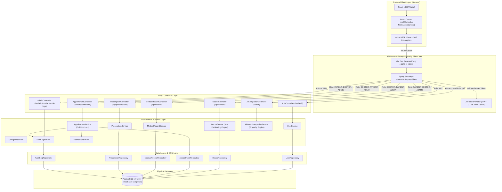

# CarePulse Portal – System Architecture Document

This document provides a technical walkthrough of the architectural patterns, security boundaries, and data flow layers in the **CarePulse Portal**.

---

## 🏛 1. High-Level Architectural Diagram

---

## 층 2. Layer-by-Layer Architectural Breakdown

### 1. Presentation Layer (Frontend SPA)
* **Framework:** React 18 with modern functional components and Hooks.
* **Build System:** Vite 5.4 providing fast Hot Module Replacement (HMR) and optimized ES bundle builds.
* **Routing:** React Router v6 with declarative `ProtectedRoute` guards and role verification (`PATIENT`, `DOCTOR`, `ADMIN`).
* **Design Language:** Glassmorphic CSS design system with custom CSS custom properties, responsive desktop/tablet layouts, and accessible color contrasts.
* **Client Networking:** Axios client with automated request interceptors attaching `Authorization: Bearer <token>` and response interceptors handling session expiry (HTTP 401).

### 2. Security & Gateway Layer (Spring Security 6 + JJWT)
* **Statelessness:** Session management is configured as `SessionCreationPolicy.STATELESS`. No server-side session cookies are created.
* **Token Architecture:** JJWT 0.12.6 signs tokens using HMAC-SHA256 (`Keys.hmacShaKeyFor`). The claims payload contains user email, user identity ID, and role.
* **Authentication Pipeline:**
  1. Incoming requests enter `JwtAuthenticationFilter`.
  2. The filter parses the `Authorization` header, extracts the JWT, and validates cryptographic integrity and expiry.
  3. Valid tokens populate Spring Security's `SecurityContextHolder` with an `Authentication` token containing `GrantedAuthority` representations of roles (`ROLE_PATIENT`, `ROLE_DOCTOR`, `ROLE_ADMIN`).
  4. Access rules configured via `@PreAuthorize` or `SecurityFilterChain` execute granular role enforcement per controller method.

### 3. Controller Layer
* Clean separation of concern using `@RestController` and `@RequestMapping`.
* All incoming payloads are validated using Jakarta Bean Validation (`@Valid`, `@NotNull`, `@NotBlank`, `@FutureOrPresent`).
* Custom Global Exception Handler (`@RestControllerAdvice`) intercepts validation errors, `ResourceNotFoundException`, and `BadRequestException`, transforming them into standardized JSON error responses with HTTP timestamps.

### 4. Service Layer (Domain Logic)
* **Conflict-Free Scheduling:** Computes doctor availability windows minus active appointments to prevent double-booking collisions.
* **Empathy Engine™:** Adapts response phrasing dynamically according to user preference (`SIMPLE`, `SUPPORTIVE`, `PROFESSIONAL`).
* **Clinical Safety Guardrails:** Attaches immutable informational disclaimers to all AI companion conversations and alerts users during potential emergencies.
* **Cross-Cutting Events:** Automatically triggers audit log entries and persistent in-app notifications upon critical events (e.g. appointment status updates, record creation).

### 5. Repository Layer (Spring Data JPA)
* Provides strongly-typed CRUD and custom JPQL queries.
* Uses indexed lookups (e.g., `findByDoctorIdAndAppointmentDate`, `countByActiveTrue`).
* Manages database transactions declaratively using `@Transactional`.

### 6. Persistence Layer (PostgreSQL)
* Third normal form (3NF) relational database schema.
* Explicit foreign key cascades and composite unique constraints (e.g., `uq_doctor_day` preventing duplicate doctor availability configurations).
* B-tree indices on frequently queried columns (`user_id`, `doctor_id`, `patient_id`, `appointment_date`, `status`).
