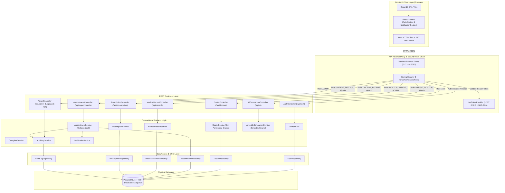
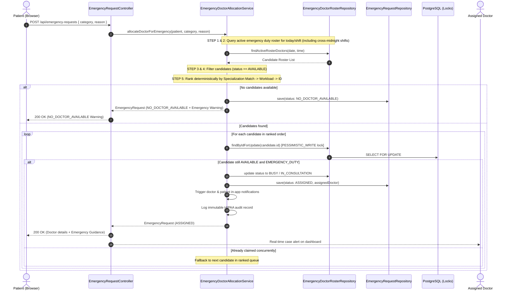

# CarePulse Portal – System Architecture Document

This document provides a technical walkthrough of the architectural patterns, security boundaries, and data flow layers in the **CarePulse Portal**.

---

## 🏛 1. High-Level Architectural Diagram

---

## 층 2. Layer-by-Layer Architectural Breakdown

### 1. Presentation Layer (Frontend SPA)
* **Framework:** React 18 with modern functional components and Hooks.
* **Build System:** Vite 5.4 providing fast Hot Module Replacement (HMR) and optimized ES bundle builds.
* **Routing:** React Router v6 with declarative `ProtectedRoute` guards and role verification (`PATIENT`, `DOCTOR`, `ADMIN`).
* **Design Language:** Glassmorphic CSS design system with custom CSS custom properties, responsive desktop/tablet layouts, and accessible color contrasts.
* **Client Networking:** Axios client with automated request interceptors attaching `Authorization: Bearer <token>` and response interceptors handling session expiry (HTTP 401).

### 2. Security & Gateway Layer (Spring Security 6 + JJWT)
* **Statelessness:** Session management is configured as `SessionCreationPolicy.STATELESS`. No server-side session cookies are created.
* **Token Architecture:** JJWT 0.12.6 signs tokens using HMAC-SHA256 (`Keys.hmacShaKeyFor`). The claims payload contains user email, user identity ID, and role.
* **Authentication Pipeline:**
  1. Incoming requests enter `JwtAuthenticationFilter`.
  2. The filter parses the `Authorization` header, extracts the JWT, and validates cryptographic integrity and expiry.
  3. Valid tokens populate Spring Security's `SecurityContextHolder` with an `Authentication` token containing `GrantedAuthority` representations of roles (`ROLE_PATIENT`, `ROLE_DOCTOR`, `ROLE_ADMIN`).
  4. Access rules configured via `@PreAuthorize` or `SecurityFilterChain` execute granular role enforcement per controller method.

### 3. Controller Layer
* Clean separation of concern using `@RestController` and `@RequestMapping`.
* All incoming payloads are validated using Jakarta Bean Validation (`@Valid`, `@NotNull`, `@NotBlank`, `@FutureOrPresent`).
* Custom Global Exception Handler (`@RestControllerAdvice`) intercepts validation errors, `ResourceNotFoundException`, and `BadRequestException`, transforming them into standardized JSON error responses with HTTP timestamps.

### 4. Service Layer (Domain Logic)
* **Conflict-Free Scheduling:** Computes doctor availability windows minus active appointments to prevent double-booking collisions.
* **Empathy Engine™:** Adapts response phrasing dynamically according to user preference (`SIMPLE`, `SUPPORTIVE`, `PROFESSIONAL`).
* **Clinical Safety Guardrails:** Attaches immutable informational disclaimers to all AI companion conversations and alerts users during potential emergencies.
* **Cross-Cutting Events:** Automatically triggers audit log entries and persistent in-app notifications upon critical events (e.g. appointment status updates, record creation).

### 5. Repository Layer (Spring Data JPA)
* Provides strongly-typed CRUD and custom JPQL queries.
* Uses indexed lookups (e.g., `findByDoctorIdAndAppointmentDate`, `countByActiveTrue`).
* Manages database transactions declaratively using `@Transactional`.

### 6. Persistence Layer (PostgreSQL)
* Third normal form (3NF) relational database schema.
* Explicit foreign key cascades and composite unique constraints (e.g., `uq_doctor_day` preventing duplicate doctor availability configurations).
* B-tree indices on frequently queried columns (`user_id`, `doctor_id`, `patient_id`, `appointment_date`, `status`).

---

## 🚨 3. Emergency Doctor Allocation & Daily Duty Roster Subsystem

### Key Architectural Tenets (Phase 2 & Phase 3)
1. **Dynamic Daily Roster & Deterministic Rotation (`EmergencyRosterGenerationService`):** No doctor is permanently an emergency physician. Administrative rosters dictate shift assignments for specific calendar dates. Admins can manually assign or click **Generate Emergency Roster** to invoke a deterministic rotation algorithm balancing 7-day historical emergency duty counts, respecting leave, appointment workloads, and mandatory rest rules (night shift physicians are never assigned next-day morning shifts).
2. **Cross-Midnight Shift Safety:** Night shifts spanning `20:00 - 08:00` evaluate active shifts across both calendar day boundaries (`shiftStart <= time OR time < shiftEnd`).
3. **Pessimistic Write Locking (`SELECT FOR UPDATE`):** When two patients trigger emergency allocation concurrently, Spring Data JPA applies `@Lock(LockModeType.PESSIMISTIC_WRITE)` on the candidate's emergency roster row (`findByIdWithLock`), preventing double-assignment races.
4. **Multi-Factor Workload Balancing & Specialization Matching (`EmergencyDoctorAllocationService`):**
   - Active emergency-duty shift verification.
   - Candidate status validation (`AVAILABLE`, with appointment overlap awareness).
   - Clinical specialization match (+1000 score bonus if matching patient's requested emergency category).
   - Active emergency caseload minimization (-200 score penalty per active case).
   - Daily total emergency load minimization (-50 score penalty per assigned case).
   - Regular appointment conflict avoidance (-100 score penalty per active scheduled appointment).
   - Deterministic ID tiebreaker.
5. **Real-Time State Transitions & Concurrency Protection:**
   - **Request Assigned:** Doctor transitions `AVAILABLE` -> `BUSY`.
   - **Doctor Starts Consultation:** Request transitions `ASSIGNED` -> `IN_PROGRESS` (`startedTime` recorded), Doctor transitions `BUSY` -> `IN_CONSULTATION`.
   - **Doctor Completes Consultation:** Request transitions `IN_PROGRESS` -> `COMPLETED` (`completedTime` recorded). If doctor has no remaining active emergency cases, doctor status transitions back to `AVAILABLE`.
   - **Waiting Queue Auto-Dispatch:** Upon case completion, the system immediately pulls the highest-priority pending request (`URGENT` first, then earliest `NORMAL`) from the `WAITING` queue and assigns it to the newly available doctor.
6. **Administrative Priority & Waiting Queue (`WAITING`):**
   - Patients can specify an administrative priority (`URGENT` or `NORMAL`).
   - If all rostered doctors are occupied (`BUSY` or `IN_CONSULTATION`), requests enter a managed waiting queue with clear guidance to contact local emergency services (911/112) for immediate life threats.
   - `NO_DOCTOR_AVAILABLE` is reserved exclusively for shifts where zero doctors are rostered.
7. **Configurable Timeout & Recovery Scheduler (`EmergencyRequestService`):**
   - A Spring `@Scheduled` background worker checks for assigned requests where the doctor has not started consultation within the configured threshold (`emergency.assignment.timeout.minutes`, default 10 min).
   - Timed-out requests are safely requeued to `WAITING`, the physician is re-evaluated, and audit events (`EMERGENCY_REQUEST_REQUEUED`) are logged.
8. **Real Database Admin Analytics & Doctor Workload View:**
   - Aggregates real DB metrics for the selected date: Total Requests, Assigned, In Progress, Completed, Waiting, No Doctor Available.
   - Generates granular doctor workload metrics: Active Cases, Completed Cases, Duty Hours, and Current Availability Status.
9. **Patient Timeline Transparency:**
   - 4-step progression timeline (`Request Created` -> `Doctor Assigned` -> `Consultation Started` -> `Emergency Completed`) backed by genuine backend timestamps (`requestTime`, `assignedTime`, `startedTime`, `completedTime`).

---

## 🛡️ 4. Production-Ready Security, Validation, Testing & Performance (Phase 4)

### 1. Authentication & Sensitive Data Masking
* **Credential Isolation:** `@JsonIgnore` is enforced on the `User.password` entity property. When entity instances or user graphs are serialized across REST endpoints, passwords and BCrypt hashes are strictly excluded from JSON representations.
* **Audit Trail Security:** Security audit events (`LOGIN_SUCCESS`, `LOGIN_FAILURE`, `ROLE_CHANGE`, `CAREGIVER_GRANTED`, `CAREGIVER_REVOKED`, `APPOINTMENT_CANCELLED`) capture only sanitized identifiers and IP metadata, strictly excluding plain passwords or JWT tokens.
* **Secret Parameterization:** Environment variables (`JWT_SECRET`, `SPRING_DATASOURCE_PASSWORD`) isolate production secrets from version control, with fallback configuration managed in `.env.example` and `application-example.properties`.

### 2. Role-Based & Resource-Level Authorization Architecture
* **Standardized 403 Forbidden Handling:** `JwtAccessDeniedHandler` intercepts all unauthorized access attempts, emitting a uniform JSON structure consistent with Spring Security conventions.
* **Dynamic Ownership Validation:**
  - Resource controllers resolve the authenticated user via `Authentication.getName()`.
  - Patients can only view/modify their own profiles, records, and appointments.
  - Authorized caregivers verify proxy access dynamically via `CaregiverService.isAuthorizedCaregiver(patientId, caregiverEmail)`.
  - Physicians are restricted to updating their own availability and clinical documentation.
  - Unauthenticated access returns HTTP 401; cross-account privilege escalation attempts return HTTP 403.

### 3. Unified Error Sanitization & DTO Validation
* **Global Exception Shield (`GlobalExceptionHandler`):**
  - Validation errors (`MethodArgumentNotValidException`) generate structured `fieldErrors` mappings.
  - Conflict conditions (`ConflictException`, `DataIntegrityViolationException`) return HTTP 409.
  - Unhandled exceptions (`Exception.class`) return a safe, generic HTTP 500 error while logging the underlying cause via SLF4J at `ERROR` level, completely preventing stack trace or SQL leakage.
* **DTO Constraint Enforcement:** Jakarta validation annotations (`@NotNull`, `@NotBlank`, `@Size`, `@Pattern`, `@Positive`, `@Min`, `@Max`, `@FutureOrPresent`) validate all inputs before reaching domain services.

### 4. Database Optimization & Constraints
* **Integrity Constraints:** Added PostgreSQL composite unique constraints (`uq_doctor_day`, `uq_roster_doc_date_shift`) to guarantee atomic data consistency at the persistence layer.
* **Query Performance Indexing:** B-Tree indexes added on frequently joined and queried columns (`users.email`, `appointments.doctor_id`, `appointments.patient_id`, `appointments.appointment_date`, `emergency_roster.roster_date`, `emergency_requests.status`, `medical_records.patient_id`, `notifications.user_id`, `audit_logs.user_id`).

### 5. Health Check & Diagnostics
* **Active Health Probe (`GET /api/health`):** Verifies service availability and database connectivity via JDBC `connection.isValid(2)` without exposing configuration or credentials. Unauthenticated access is explicitly permitted in `SecurityConfig`.

### 6. Containerization & CI/CD Pipeline
* **Backend Containerization (`backend/Dockerfile`):** Multi-stage build leveraging Eclipse Temurin 17 JRE slim, running as an unprivileged non-root user (`carepulse:carepulse`).
* **Frontend Containerization (`frontend/Dockerfile` & `nginx.conf`):** Multi-stage build utilizing Node 20 and Alpine Nginx with reverse proxy pass-through to `/api`, asset caching, and client-side SPA routing (`try_files $uri /index.html`).
* **Multi-Container Composition (`docker-compose.yml`):** Orchestrates PostgreSQL 16, backend Spring Boot, and frontend React services on an internal bridge network with health dependencies.
* **GitHub Actions CI (`.github/workflows/ci.yml`):** Automatically tests backend Java suite, verifies packaging, installs frontend packages, and runs Vite production builds on every push and PR to `main`.

